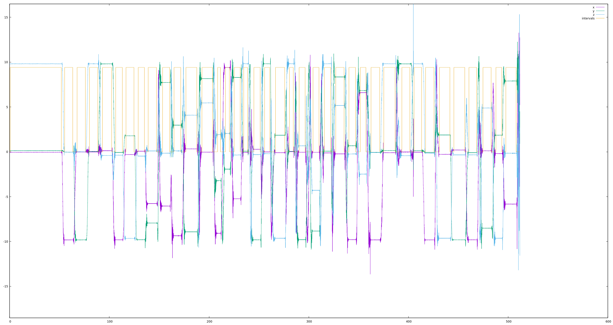
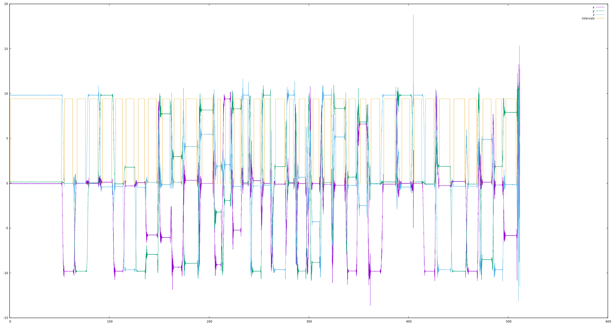

# 第五章作业

## 针对加速度计的雅各比推导

为了后续修改源代码方便，这里使用开源代码中的Triad定义进行推导，具体定义如下：

加速度计安装误差矩阵
$$
T=\begin{bmatrix} 1 & 0 & 0\\ mis_{xz} & 1 & 0 \\ -mis_{xy} & mis_{yx} &  1\end{bmatrix}
$$
刻度系数误差矩阵
$$
K = \begin{bmatrix} s_x & 0 & 0 \\ 0 & s_y & 0 \\ 0 & 0 & s_z  \end{bmatrix}
$$
偏差向量
$$
B = \begin{bmatrix} b_x \\ b_y \\ b_z \end{bmatrix}
$$
当给定一个加速度计读数时$X$，其对应的真实加速度值$X'$按照下式计算
$$
X'=T*K*(X-B)
$$


当使用解析求导时，残差函数定义为
$$
f(\theta^{acc})=||g||_2-||X'||_2
$$
则对应的雅各比为
$$
\frac{\partial f}{\partial \theta^{acc}}=\frac{\partial f}{\partial ||X'||_2}\frac{\partial ||X'||_2}{\partial X'}\frac{\partial X'}{\partial \theta^{acc}}=-\frac{X'}{|X'|}\frac{\partial X'}{\partial \theta^{acc}}
$$
其中
$$
X' = \begin{bmatrix} s_x(A_x-b_x) \\ mis_{xz} s_x(A_x - b_x) + s_y(A_y - b_y) \\ -mis_{xy}s_x(A_x - b_x) + mis_{yx}s_y(A_y - b_y) + s_z(A_z - b_z) \end{bmatrix}
$$
故
$$
\frac{\partial X'}{\partial \theta^{acc}} = \begin{bmatrix} 0 & 0 & 0 & A_x-b_x & 0 & 0 & -s_x & 0 & 0 \\ s_x(A_x-b_x) & 0 & 0 & mis_{xz}(A_x-b_x) & A_y-b_y & 0 & -mis_{xz}s_x & -s_y & 0 \\ 0 & -s_x(A_x-b_x) & s_y(A_y-b_y) & -mis_{xy}(A_x - b_x) & mis_{yx}(A_y-b_y) & (A_z-b_z) & mis_{xy}s_x & -mis_{yx}s_y & -s_z\end{bmatrix}
$$

## 自动求导

将安装系数矩阵修改为下三角矩阵，使用自动求导方式进行标定，结果如下



```bash
Accelerometers calibration: Better calibration obtained using threshold multiplier 6 with residual 0.120131
Misalignment Matrix
          1          -0           0
-0.00354989           1          -0
-0.00890444  -0.0213032           1
Scale Matrix
0.00241267          0          0
         0 0.00242659          0
         0          0 0.00241232
Bias Vector
33124.2
33275.2
32364.4

Accelerometers calibration: inverse scale factors:
414.478
412.102
414.538


Gyroscopes calibration: residual 0.00150696
Misalignment Matrix
         1 0.00927517 0.00990014
0.00507442          1 -0.0322229
 0.0162201 -0.0239393          1
Scale Matrix
0.000209338           0           0
          0 0.000209834           0
          0           0 0.000209664
Bias Vector
32777.1
32459.8
32511.8

Gyroscopes calibration: inverse scale factors:
4776.96
4765.68
4769.53
```

## 解析式求导

```c++
class AnalyticMultiPosAccResidual : public ceres::SizedCostFunction<1, 9> {
  public:
    AnalyticMultiPosAccResidual(const _T1 &g_mag, const Eigen::Matrix< _T1, 3 , 1> &sample)
      : g_mag_(g_mag), sample_(sample) {}
    
    virtual ~AnalyticMultiPosAccResidual() {}

    virtual bool Evaluate(double const* const* params, double *residuals, double **jacobians) const {
        const double Txz = params[0][0];
        const double Txy = params[0][1];
        const double Tyx = params[0][2];
        const double Kx = params[0][3];
        const double Ky = params[0][4];
        const double Kz = params[0][5];
        const double bx = params[0][6];
        const double by = params[0][7];
        const double bz = params[0][8];

        // 下三角模型
        // 安装误差矩阵
        Eigen::Matrix<double, 3, 3> T;
        T << 1   , 0   , 0, 
             Txz , 1   , 0, 
             -Txy, Tyx , 1;
        
        // 刻度误差系数矩阵
        Eigen::Matrix3d K = Eigen::Matrix3d::Identity();
        K(0, 0) = Kx;
        K(1, 1) = Ky;
        K(2, 2) = Kz;

        // 偏差向量
        Eigen::Vector3d bias(bx, by, bz);
        
        Eigen::Matrix<double,3,1 > sample(double(sample_(0)),double(sample_(1)),double(sample_(2)));

        Eigen::Vector3d calib_samp = T * K * (sample.col(0) - bias);

        residuals[0] = g_mag_ - calib_samp.norm();

        if (jacobians != nullptr) {
            if (jacobians[0] != nullptr) {
                Eigen::Vector3d x_xnorm = calib_samp / (calib_samp.norm());
                // 测量值减去bias
                Eigen::Vector3d v = sample.col(0) - bias;
                // calib_samp 对参数的偏导
                Eigen::Matrix<double, 3, 9> J_theta = Eigen::Matrix<double, 3, 9>::Zero();
                J_theta(0, 3) = v(0);
                J_theta(0, 6) = -Kx;
                J_theta(1, 0) = Kx * v(0);
                J_theta(1, 3) = Txz * v(0);
                J_theta(1, 4) = v(1);
                J_theta(1, 6) = -Txz * Kx;
                J_theta(1, 7) = -Ky;
                J_theta(2, 1) = -Kx * v(0);
                J_theta(2, 2) = Ky * v(1);
                J_theta(2, 3) = -Txy * v(0);
                J_theta(2, 4) = Tyx * v(1);
                J_theta(2, 5) = v(2);
                J_theta(2, 6) = Txy * Kx;
                J_theta(2, 7) = -Tyx * Ky;
                J_theta(2, 8) = -Kz;
                Eigen::Matrix<double, 1, 9> Jaco = - x_xnorm.transpose() * J_theta;
                jacobians[0][0] = Jaco(0, 0);
                jacobians[0][1] = Jaco(0, 1);
                jacobians[0][2] = Jaco(0, 2);
                jacobians[0][3] = Jaco(0, 3);
                jacobians[0][4] = Jaco(0, 4);
                jacobians[0][5] = Jaco(0, 5);
                jacobians[0][6] = Jaco(0, 6);
                jacobians[0][7] = Jaco(0, 7);
                jacobians[0][8] = Jaco(0, 8);
            }
        }
        return true;
    }

  private:
    const _T1 g_mag_;
    const Eigen::Matrix< _T1, 3 , 1> sample_;
};
```



```bash
Accelerometers calibration: Better calibration obtained using threshold multiplier 6 with residual 0.120131
Misalignment Matrix
          1          -0           0
-0.00354989           1          -0
-0.00890444  -0.0213032           1
Scale Matrix
0.00241267          0          0
         0 0.00242659          0
         0          0 0.00241232
Bias Vector
33124.2
33275.2
32364.4

Accelerometers calibration: inverse scale factors:
414.478
412.102
414.538

Gyroscopes calibration: residual 0.00150696
Misalignment Matrix
         1 0.00927517 0.00990014
0.00507442          1 -0.0322229
 0.0162201 -0.0239393          1
Scale Matrix
0.000209338           0           0
          0 0.000209834           0
          0           0 0.000209664
Bias Vector
32777.1
32459.8
32511.8

Gyroscopes calibration: inverse scale factors:
4776.96
4765.68
4769.53
```

根据结果对比可以看出，解析求导的实现是正确的