# 第六章作业

## 根据课程给定的数据，完成基于中值法的解算;

根据课程框架的提示，补全基于中值法的解算，代码如下:

```c++
bool Activity::UpdatePose(void) {
    if (!initialized_) {
        // 使用最近一次的里程计进行初始化:
        OdomData &odom_data = odom_data_buff_.back();
        IMUData imu_data = imu_data_buff_.back();

        pose_ = odom_data.pose;
        vel_ = odom_data.vel;

        initialized_ = true;

        odom_data_buff_.clear();
        imu_data_buff_.clear();

        // keep the latest IMU measurement for mid-value integration:
        imu_data_buff_.push_back(imu_data);
    } else {
        // 获取角度:
        Eigen::Vector3d angular_delta; 

        GetAngularDelta(1, 0, angular_delta);

        // 更新旋转:
        Eigen::Matrix3d R_curr, R_prev;
        UpdateOrientation(angular_delta, R_curr, R_prev);

        // 获取速度信息:
        double delta_t;
        Eigen::Vector3d velocity_delta;
        GetVelocityDelta(1, 0, R_curr, R_prev, delta_t, velocity_delta);

        // 更新位置:
        UpdatePosition(delta_t, velocity_delta);

        // 移除最早的数据:
        imu_data_buff_.pop_front();

    }
    
    return true;
}
```

结果如下:

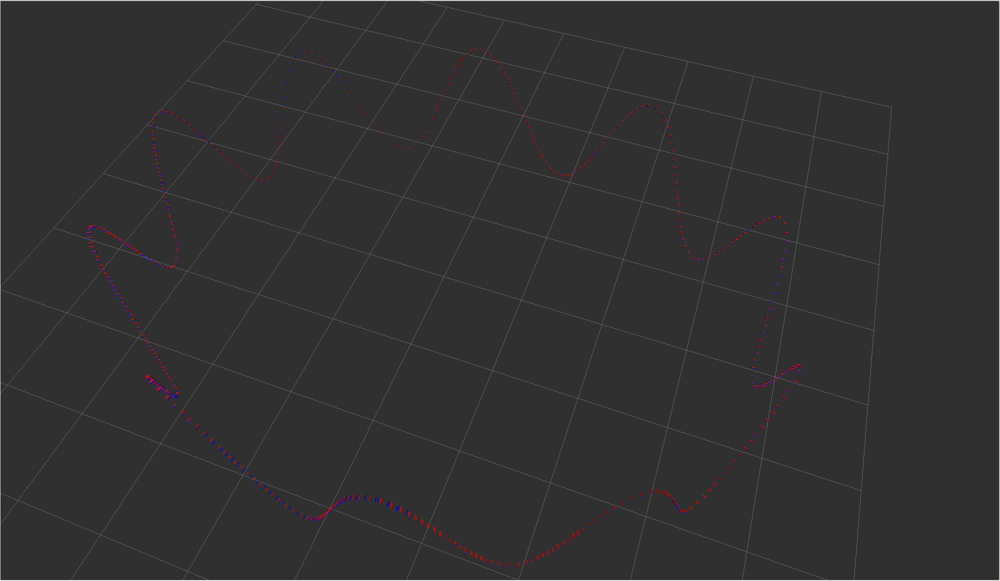

## 根据课程给定的数据，完成基于中值法、欧拉法的解算，并对精度做对比分析

将中值法改为欧拉法，主要修改地方如下

```c++
    //angular_delta = 0.5*delta_t*(angular_vel_curr + angular_vel_prev);
    angular_delta = delta_t*angular_vel_prev;

    //velocity_delta = 0.5*delta_t*(linear_acc_curr + linear_acc_prev);
    velocity_delta = delta_t* linear_acc_prev;
```

将中值法与欧拉法进行对比，结果如下:

|       中值法        |       欧拉法        |
| :-----------------: | :-----------------: |
|  |  |

从图中可以明显看出，随着时间的增加，欧拉法的累积误差的增加速度远远大于中值法，也证明了在课程数据的运动模式和IMU采样频率下，中值法有着良好的精度。

## 利用IMU仿真程序，自己生成不同运动状况(静止、匀速、加减速、快速转弯等)的仿真数 据，对比两种解算方法精度差异与运动状况的关系，并给出原因分析

使用`gnss-ins-sim`生成不同状况下的数据并保存为`bag`文件，使用仿真器中提供的`ref`量当作真值，并对比中值法和欧拉法的结果。

为了能够使用`evo`进行评价，单独编写了一个文件输出节点，具体代码参见`evaluater/evaluate.cpp`

### 剧烈运动

| 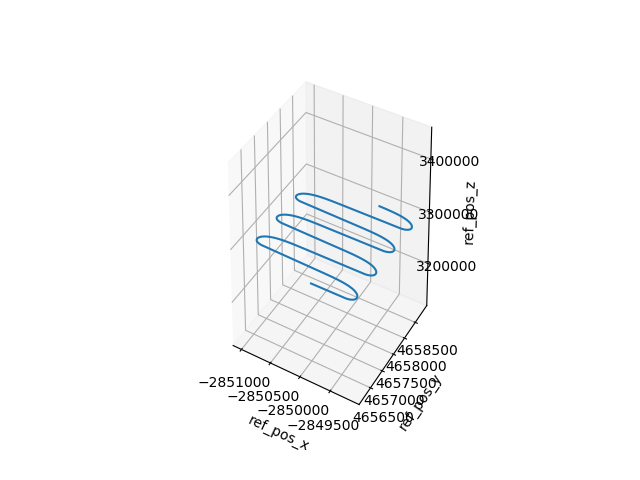 |  |
| --------------------------------- | --------------------------------- |

|        中值法        |              欧拉法               |
| :------------------: | :-------------------------------: |
| 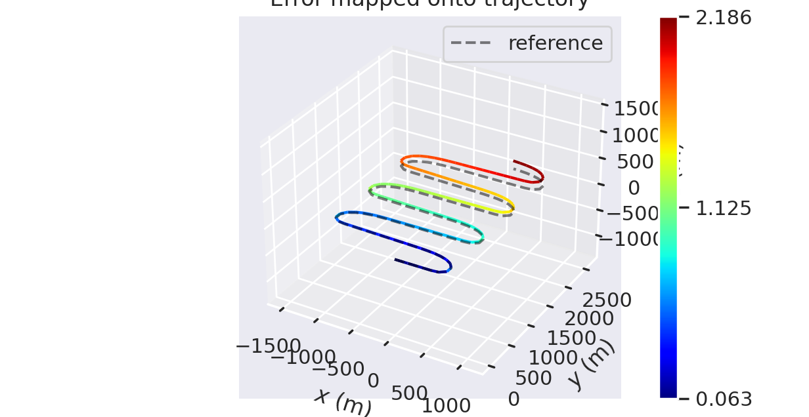 | 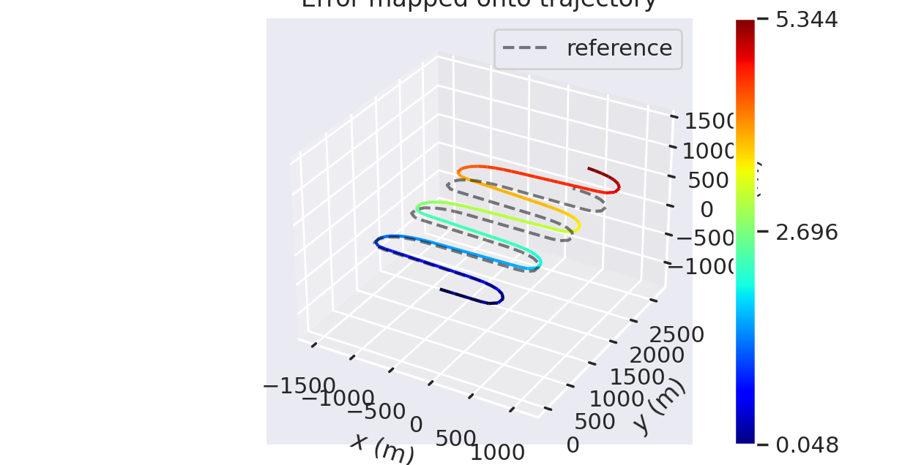 |
| 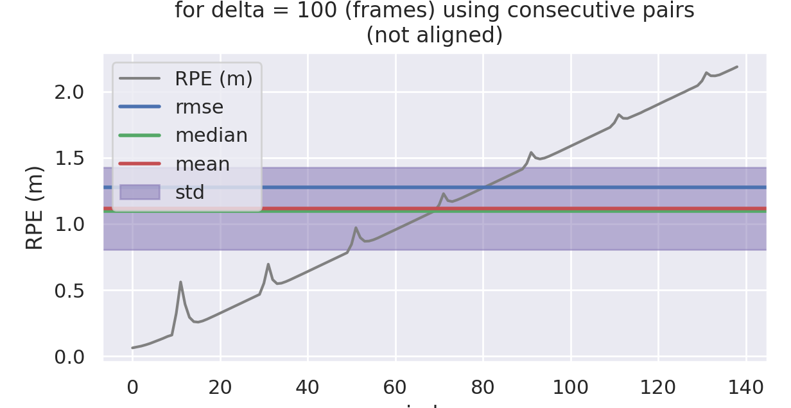 |  |
|  |        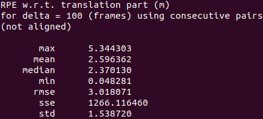        |

### 匀速运动

| 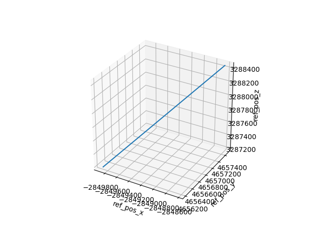 | 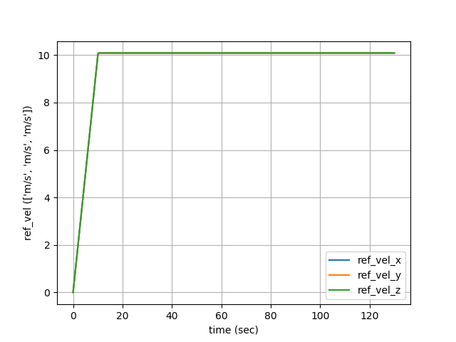 |
| -------------------- | -------------------- |

|        中值法        |        欧拉法        |
| :------------------: | :------------------: |
| 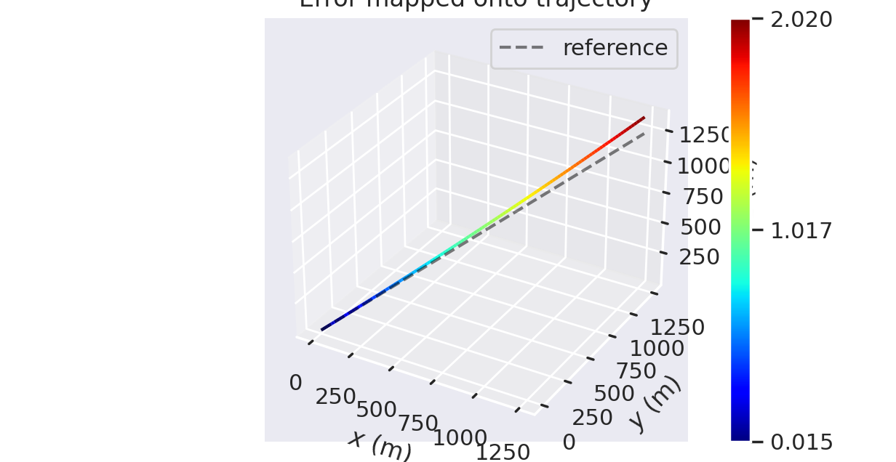 |  |
|  | 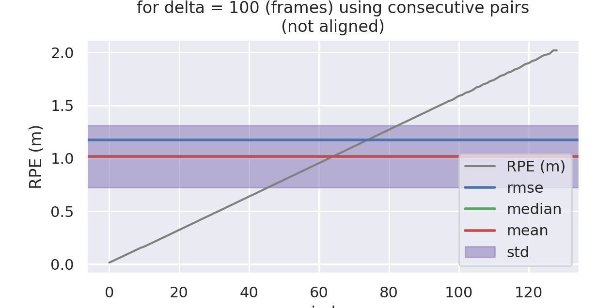 |
| 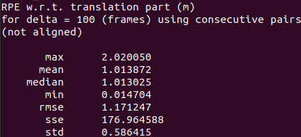 |  |

### 加速运动

|  | 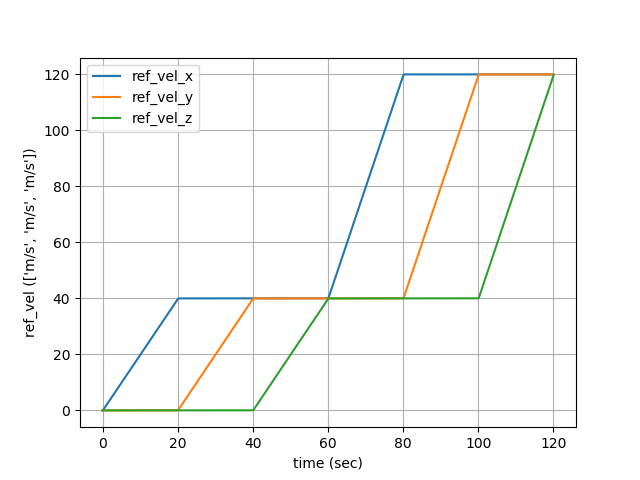 |
| -------------------- | -------------------- |

|        中值法        |        欧拉法        |
| :------------------: | :------------------: |
|  | 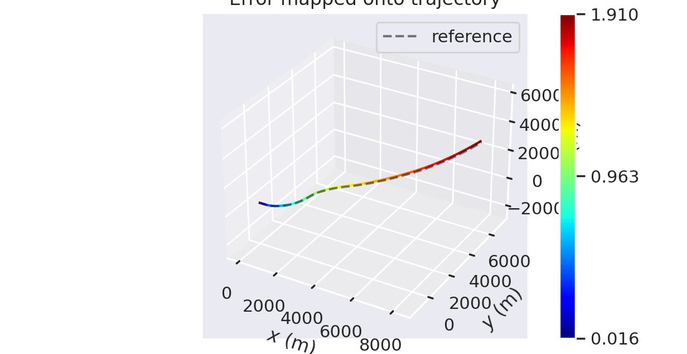 |
|  | 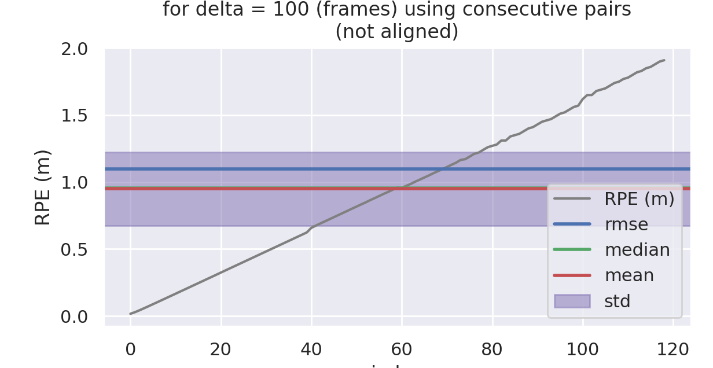 |
|  | 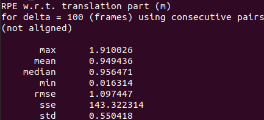 |

根据上述结果的对比可知：对于惯性解算来说，在变速运动的情况下中值法的精度会显著高于欧拉法，并且运动越剧烈，精度差异越大，这主要是由数值积分算法的精度引起的，对于数值积分算法来说，对于积分曲线的的局部拟合越精确，积分结果就越准确。欧拉法使用左端点的导数代替区间内的导数，而中值法使用两个端点的导数的均值代替区间内的导数，当运动剧烈时，区间内的导数与左端点的导数相差较大，欧拉法积分结果误差比较大，而对于中值法来说，由于运动的连续性及测量元件的高频性，左右端点均值的积分与区间内的逐点积分结果相差比欧拉法要小，结果要更加精确。而当慢加减速或者匀速运动时，由于测量元件的高频性，欧拉法与中值法对于局部导数的近似结果是基本一致的，精度也是类似的。当然，还可以选择更高精度的数值积分方法，比如`四阶龙格库塔法`等，但是出于计算复杂性和精度的综合考量，在高频测量单元的情况下，中值法不失为一个惯性解算的良好方法。

