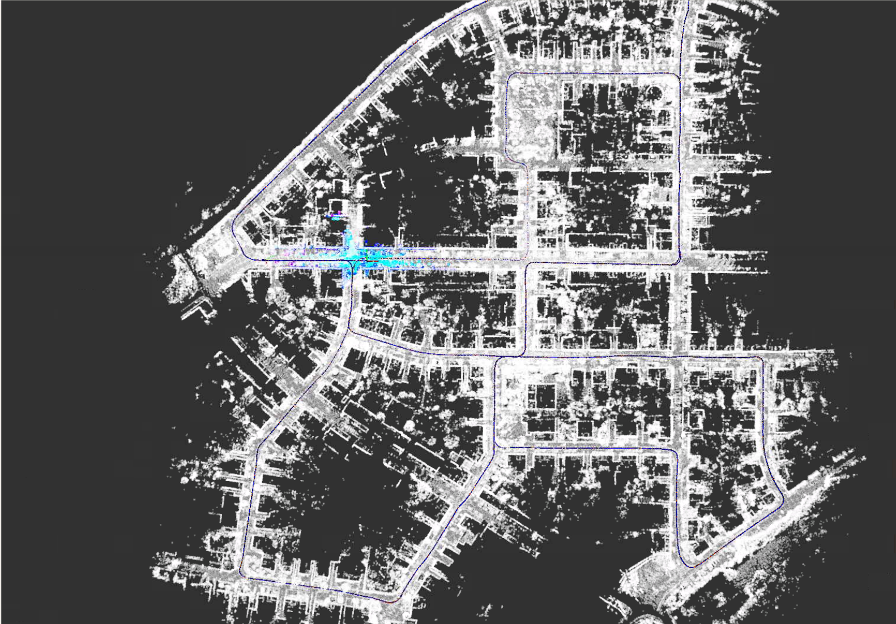
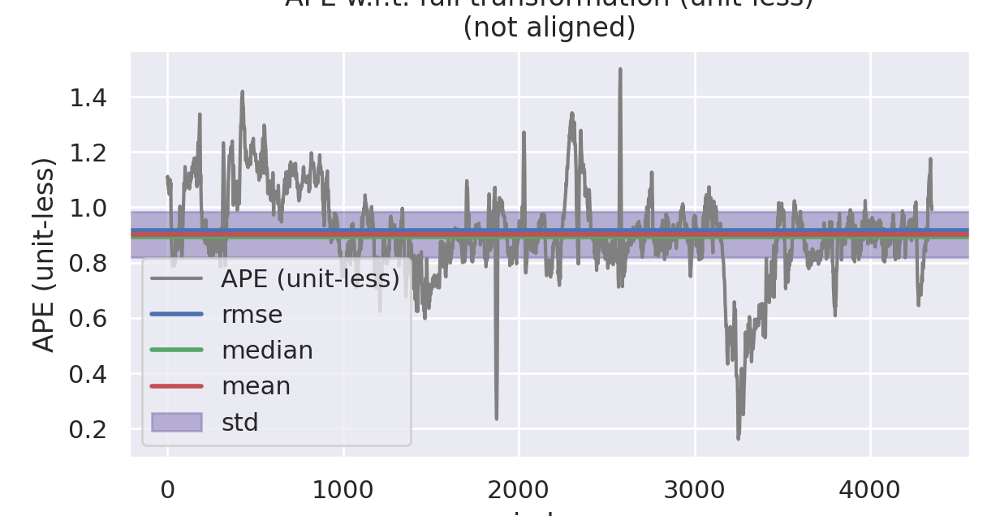
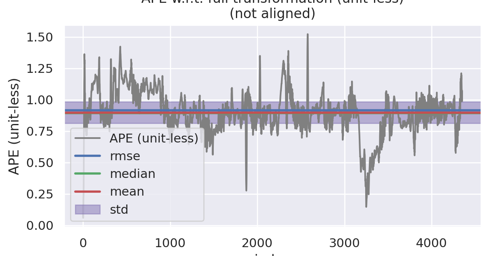
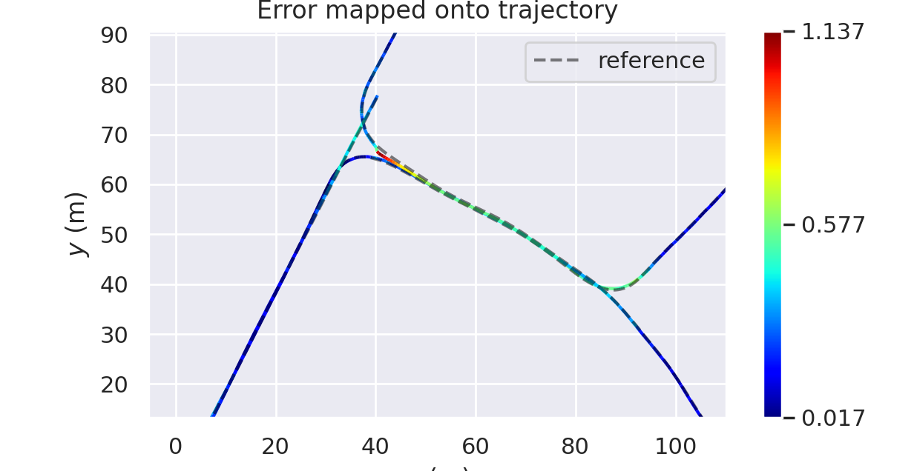

# 第七章作业

## 补全代码，且滤波功能正常

根据ppt中的公式和代码中的提示，补全了ESKF的框架，并可以正常编译和运行



## 补全代码，功能正常，且经过调试参数，滤波后性能比滤波前好

使用evo评价工具进行对比

### 滤波前

|  |  |
| --------------------------------- | --------------------------------- |

```bash
APE w.r.t. full transformation (unit-less)
(not aligned)

       max	1.500344
      mean	0.901765
    median	0.893769
       min	0.161967
      rmse	0.916786
       sse	3657.841542
       std	0.165277
```

### 滤波后

|  |  |
| --------------------------------- | --------------------------------- |

```bash
APE w.r.t. full transformation (unit-less)
(not aligned)

       max	1.521982
      mean	0.897535
    median	0.894192
       min	0.058380
      rmse	0.913938
       sse	3635.146581
       std	0.172374
```

从上述数据可以看出，滤波后误差的均值有所下降，同时对比滤波前后开始段的轨迹

| 滤波前              | 滤波后              |
| ------------------- | ------------------- |
|  |  |

可以看出在开始段滤波后的轨迹比滤波前更加接近真值。

## 不考虑随机游走模型时的推导过程

首先列出误差方程
$$
\delta\dot{p}=\delta v \\ \delta \dot{v} = -R_t[a_t-b_{a_t}]_{\times}\delta \theta + R_t(n_a-\delta b_a) \\ \delta \dot{\theta} = -[\omega_t-b_{\omega t}]_{\times}\delta \theta + n_{\omega} - \delta b_{\omega}\\
\delta\dot{b}_a = 0 \\ 
\delta \dot{b}_{\omega} = 0
$$
与考虑随机游走的情况对比，可知，主要的差别在$B$矩阵，连续情况下的B矩阵如下
$$
\boldsymbol B_t =
\begin{bmatrix}
0 & 0 & 0 & 0  \\
\boldsymbol R_t & 0 &0 & 0 \\
0 & \boldsymbol I_3 & 0 & 0 \\
0 & 0 & 0 & 0 \\
0 & 0 & 0 & 0
\end{bmatrix}
$$
离散情况下的$B$矩阵如下
$$
\boldsymbol B_{k-1} =
\begin{bmatrix}
0 & 0 & 0 & 0 \\
\boldsymbol R_{k-1}T &0 & 0 & 0 \\
0 & \boldsymbol I_3T & 0 & 0\\
0 & 0 & 0 & 0\\
0 & 0 & 0 & 0
\end{bmatrix}
$$
对应的噪声项
$$
w = \begin{bmatrix} n_a \\ n_{\omega} \\ 0 \\ 0 \end{bmatrix}
$$
使用默认参数，考虑随机游走情况下的结果如下

```bash
APE w.r.t. full transformation (unit-less)
(not aligned)

       max	1.520900
      mean	0.899698
    median	0.896427
       min	0.054898
      rmse	0.915499
       sse	3650.933887
       std	0.169360
```

不考虑随机游走情况下的结果如下

```bash
APE w.r.t. full transformation (unit-less)
(not aligned)

       max	1.492592
      mean	0.899016
    median	0.892805
       min	0.054880
      rmse	0.914985
       sse	3650.181899
       std	0.170199
```

结果大致相似，从理论上来讲，考虑随机游走的情况应该会更好，因为根据卡尔曼滤波器的理论，若不考虑不随机游走，根据增益的计算方式，观测值无法对零偏形成矫正关系，而位置和姿态的计算又依赖于零偏。但是，根据实际的实验，两者的效果基本没有区别，影响效果的关键还是参数的选择。

## 不同噪声设置情况下的结果对比(至少5组参数)

### 参数1

```bash
    covariance:
        prior:
            pos: 1.0e-5
            vel: 1.0e-5
            ori: 1.0e-5
            epsilon: 1.0e-6
            delta: 1.0e-6
        process:
            gyro_noise: 1.0e-5
            accel_noise: 2.5e-5
            gyro_walk: 1.0e-5
            accel_walk: 2.5e-5
        measurement:
            pose:
                pos: 2.0e-1
                ori: 2.0e-1
            pos: 1.0e-4
            vel: 2.5e-3
```

滤波前

```bash
   max	1.136680
  mean	0.231142
median	0.163627
   min	0.017465
  rmse	0.289274
   sse	366.600726
   std	0.173934
```

滤波后

```bash
   max	1.789425
  mean	0.316181
median	0.248966
   min	0.026810
  rmse	0.387849
   sse	659.019287
   std	0.224624
```

### 参数2

```bash
    covariance:
        prior:
            pos: 1.0e-5
            vel: 1.0e-5
            ori: 1.0e-5
            epsilon: 1.0e-6
            delta: 1.0e-6
        process:
            gyro_noise: 1.0e-5
            accel_noise: 2.5e-5
            gyro_walk: 1.0e-5
            accel_walk: 2.5e-5
        measurement:
            pose:
                pos: 2.0e-3
                ori: 2.0e-1
            pos: 1.0e-4
            vel: 2.5e-3
```

滤波前

```bash
   max	1.136680
  mean	0.231931
median	0.164036
   min	0.017465
  rmse	0.290173
   sse	366.691964
   std	0.174380
```

滤波后

```bash
   max	1.131317
  mean	0.278159
median	0.225524
   min	0.029205
  rmse	0.330322
   sse	475.185780
   std	0.178158
```

### 参数3

```bash
    covariance:
        prior:
            pos: 1.0e-5
            vel: 1.0e-5
            ori: 1.0e-5
            epsilon: 1.0e-6
            delta: 1.0e-6
        process:
            gyro_noise: 1.0e-5
            accel_noise: 2.5e-5
            gyro_walk: 1.0e-5
            accel_walk: 2.5e-5
        measurement:
            pose:
                pos: 1.0e-4
                ori: 1.0e-2
            pos: 1.0e-4
            vel: 2.5e-3
```

滤波前

```bash
   max	1.136680
  mean	0.231342
median	0.163955
   min	0.017465
  rmse	0.289456
   sse	365.972245
   std	0.173971
```

滤波后

```bash
   max	1.194392
  mean	0.258817
median	0.198141
   min	0.029705
  rmse	0.310314
   sse	420.615034
   std	0.171197
```

### 参数4

```bash
    covariance:
        prior:
            pos: 1.0e-5
            vel: 1.0e-5
            ori: 1.0e-5
            epsilon: 1.0e-6
            delta: 1.0e-6
        process:
            gyro_noise: 1.0e-6
            accel_noise: 1.0e-5
            gyro_walk: 1.0e-5
            accel_walk: 2.5e-4
        measurement:
            pose:
                pos: 1.0e-6
                ori: 1.0e-6
            pos: 1.0e-4
            vel: 2.5e-3
```

滤波前

```bash
   max	1.136680
  mean	0.231342
median	0.163955
   min	0.017465
  rmse	0.289456
   sse	365.972245
   std	0.173971
```

滤波后

```bash
   max	1.145750
  mean	0.243301
median	0.182558
   min	0.015522
  rmse	0.297851
   sse	388.483635
   std	0.171814
```

### 参数5

```bash
    covariance:
 		prior:
            pos: 1.0e-6
            vel: 1.0e-6
            ori: 1.0e-6
            epsilon: 1.0e-6
            delta: 1.0e-6
        process:
            gyro_noise: 2.5e-2
            accel_noise: 1.0e-2
            gyro_walk: 1.0e-4
            accel_walk: 1.0e-3
        measurement:
            pose:
                pos: 1.0e-6
                ori: 1.0e-6
            pos: 1.0e-4
            vel: 2.5e-3
```

滤波前

```bash
   max	1.136680
  mean	0.231342
median	0.163955
   min	0.017465
  rmse	0.289456
   sse	365.972245
   std	0.173971
```

滤波后

```bash
   max	1.164980
  mean	0.234870
median	0.168759
   min	0.017150
  rmse	0.291701
   sse	373.116764
   std	0.172989
```

